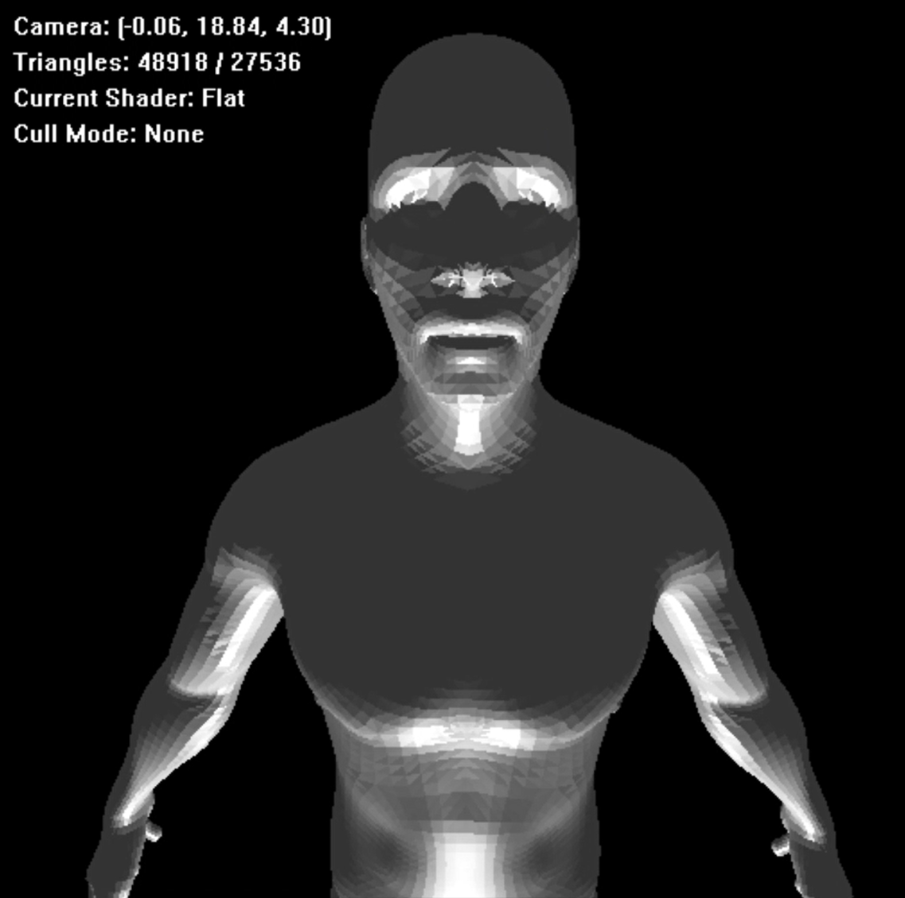
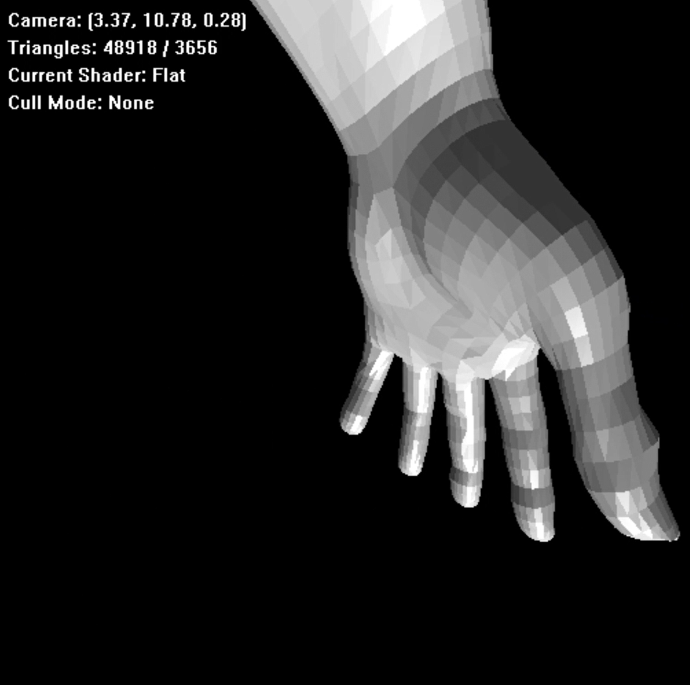
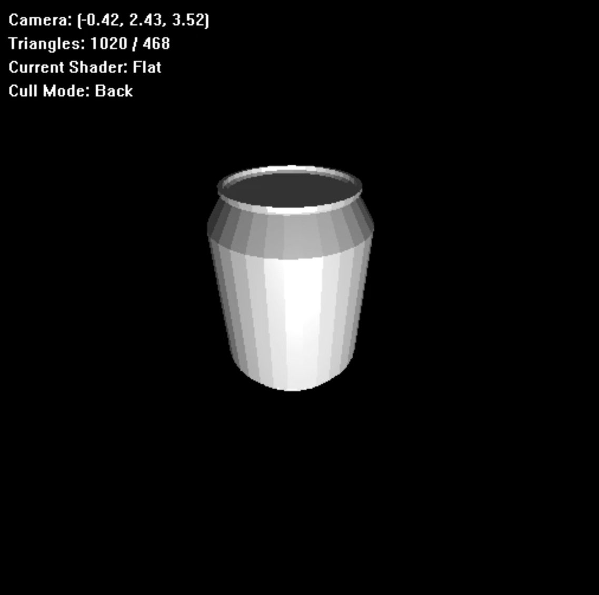
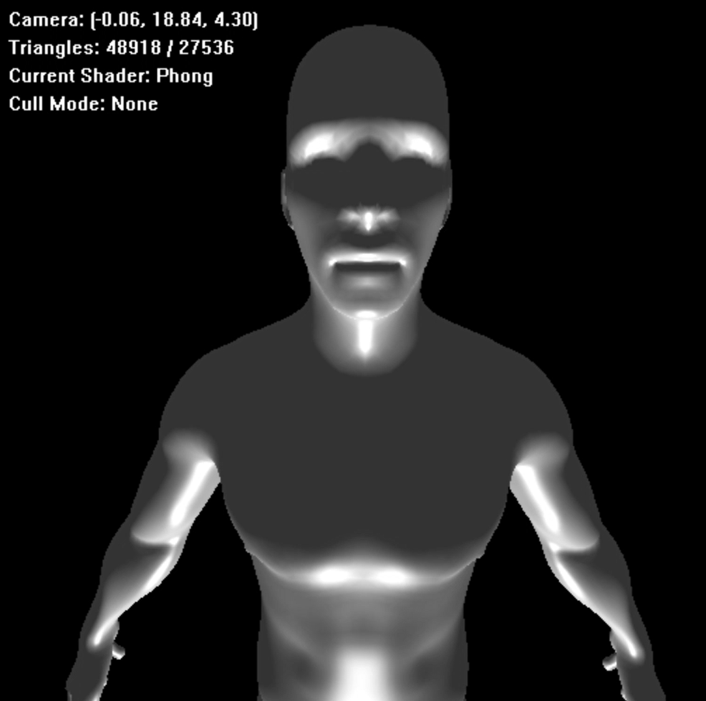
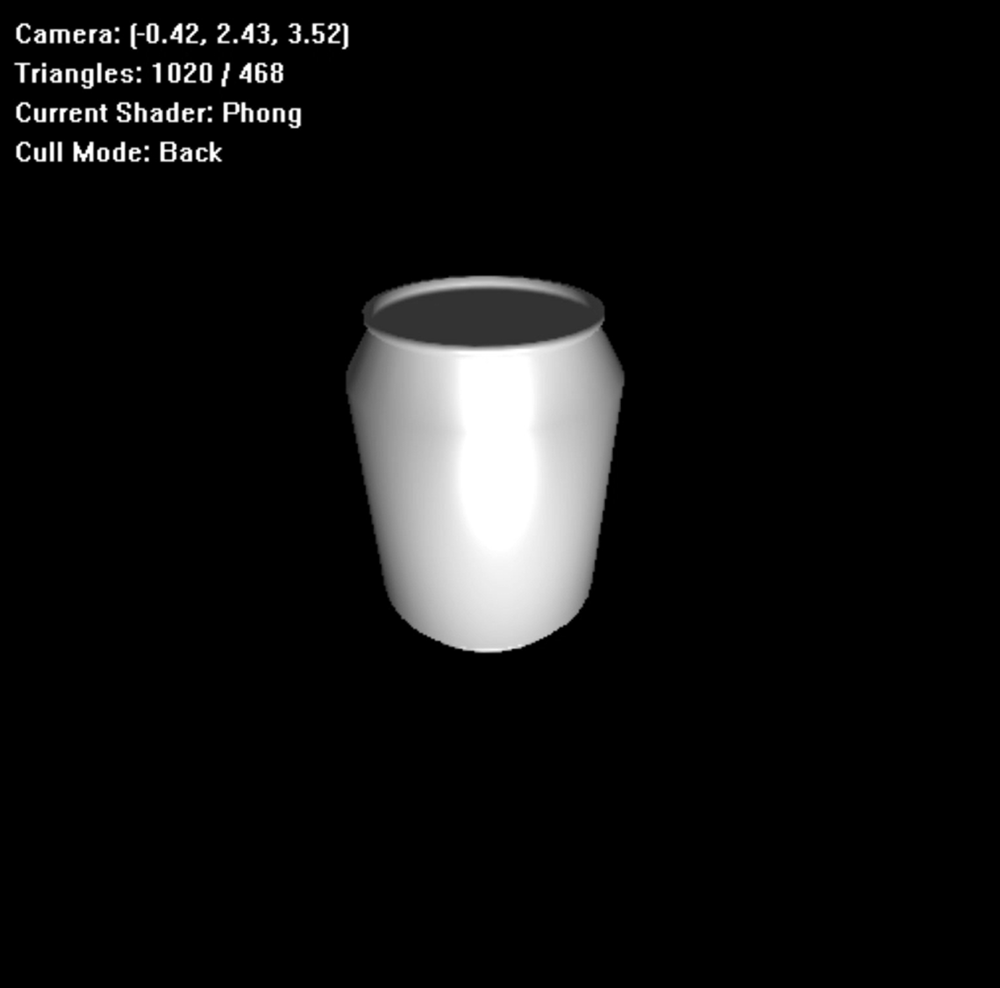

## 基于C++的软光栅渲染器与网格处理系统

## v 1.0.0
---
|  |  |  |
|  |  |  |

---
###
该版本实现了基础cpu软光栅渲染器以及部分优化（视锥裁剪、背面剔除等），并支持.obj模型导入。
在release模式下可流畅渲染4万+面的模型
### 环境
```
Windows 11
Visual Studio 2022
Eigen 5.0.0
```
### 1. 构建
```bash
cmake -S . -B build
cmake --build build --config Release
```

### 2. 运行

支持导入obj模型
需要指定模型路径
```bash
.\build\Release\mesh_lab.exe assets\coca-cola.obj
```

### 3. 操作

1. WASD控制前后左右移动
2. Shift、Space控制上下移动
3. 右键+移动鼠标控制摄像机朝向
4. 按R切换着色模型(目前支持Flat Shading和Blinn-Phong Shading)
5. 按F切换背面剔除的模式（无，剔除背面，剔除正面）

### 4. 项目结构
```
src/
├── core/          数学类型
├── geometry/      Mesh / HalfEdgeMesh
├── renderer/      Rasterizer / Shader / FrameBuffer / Camera
├── window/        Win32Window
├── ObjIO.h        obj读取工具
├── ObjIO.cpp      obj读取工具
└── main.cpp       程序入口
```
### 5. 注意事项

目前暂不支持纹理贴图，主要以白模渲染和几何结构可视化为主

### 6. 后续计划

基于已实现的软光栅渲染器与基础网格数据结构，进行几何算法实验与开发，扩展为网格处理系统